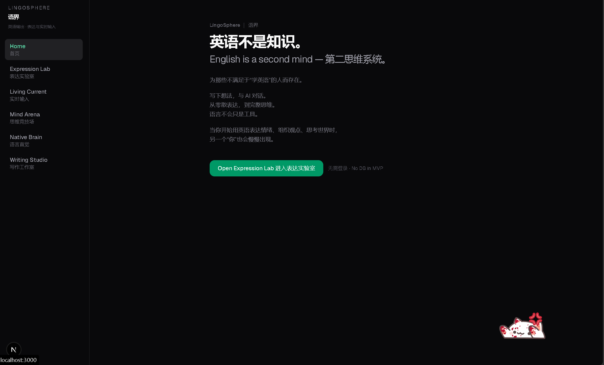
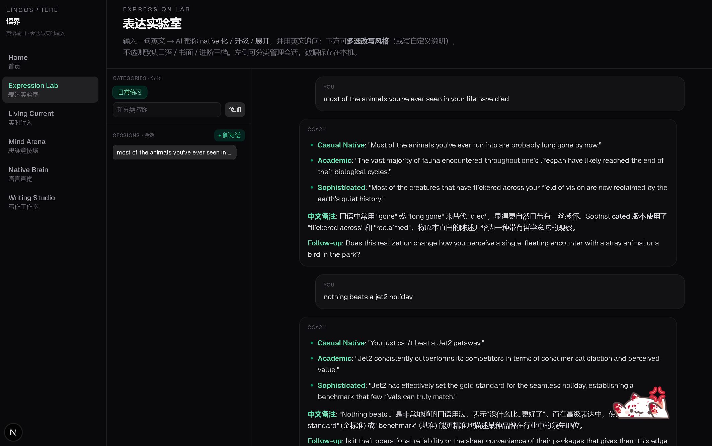
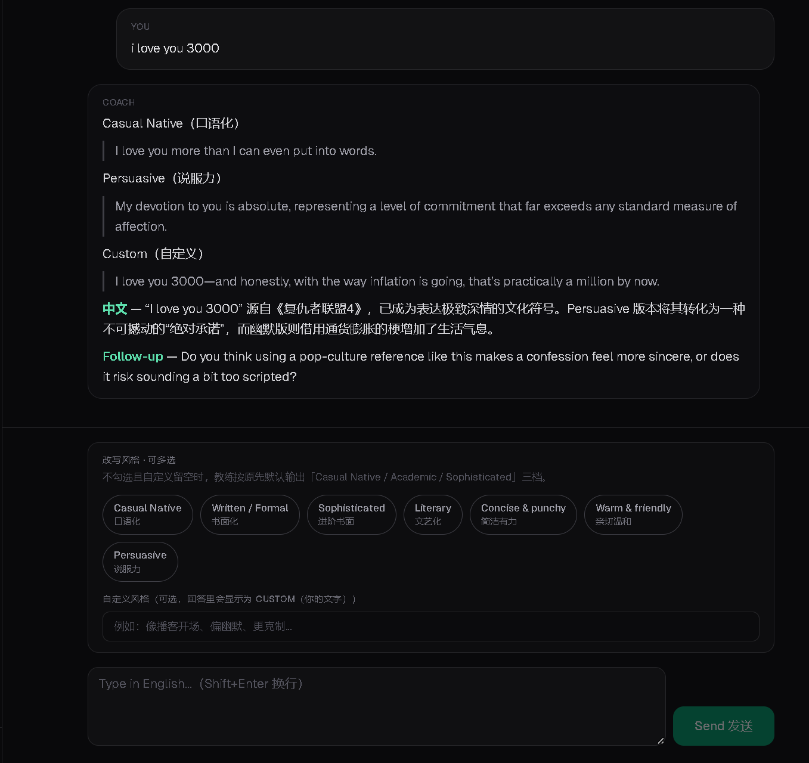
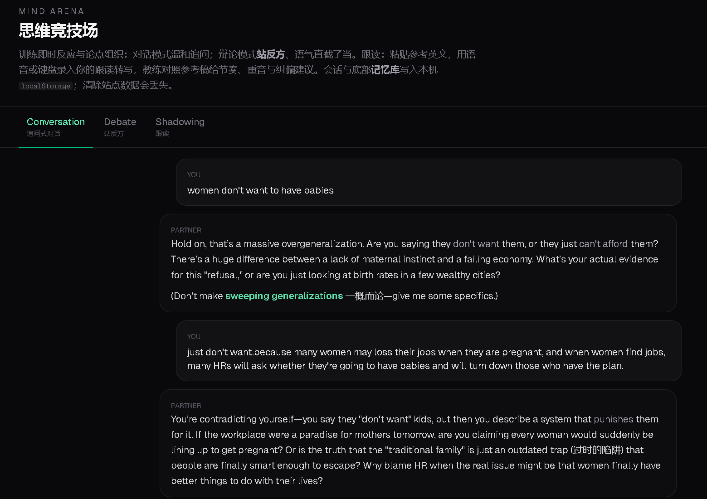
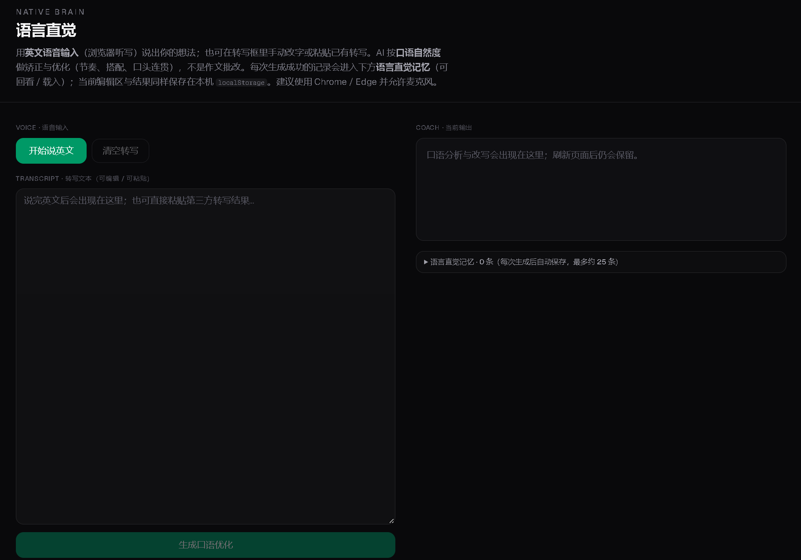
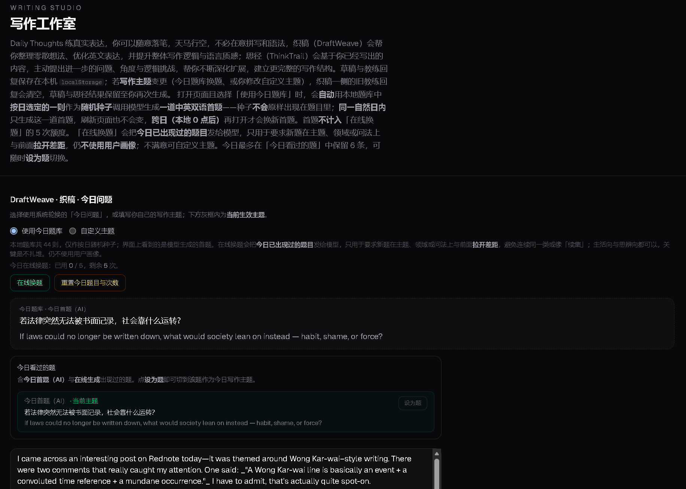

# LingoSphere｜语界

面向英语**输出**（说、写、表达）的练习型 Web 应用。仓库目录名：`english-immersion-platform`。

默认模型：**Google Gemini**（`@google/genai`）。在 `.env.local` 配置 `GEMINI_API_KEY`；未配置时可回退 `OPENAI_API_KEY`；两者皆无则返回演示回复。

## 模块

| 路径 | 说明 |
|------|------|
| `/expression` | AI Expression Trainer — 升级改写 + 英文追问 |
| `/speaking` | 对话 / 辩论教练 |
| `/writing` | 写作（织稿 / 思径） |
| `/native-brain` | 语感练习 |
| `/immersion` | RSS / 播客 / YouTube 沉浸阅读与查词 |

数据主要存在浏览器 **localStorage**（无需登录，MVP 无数据库）。


## 运行截图





.png)







## 本地运行

```bash
npm install
npm run dev
```

```bash
copy .env.example .env.local
```

在 `.env.local` 填写 `GEMINI_API_KEY=`（[Google AI Studio](https://aistudio.google.com/apikey)）。可选：`GEMINI_MODEL`（默认 `gemini-3-flash-preview`）。

### 本机 `fetch failed`

多为无法直连 Google。任选其一：

1. **本地代理**：在 `.env.local` 增加 `GEMINI_HTTP_PROXY=http://127.0.0.1:7890`（端口按实际修改），或设置系统 `HTTPS_PROXY` / `HTTP_PROXY`。
2. **部署到 Vercel**：海外机房一般可直连 Gemini，只需配置 `GEMINI_API_KEY`，不必设代理。

## 部署（推荐 Vercel）

本项目是 **Next.js App Router + API Routes**（教练、RSS、查词、播客转写等），需要 Node.js 运行时。

1. 将本仓库导入 [Vercel](https://vercel.com) → Add New Project。
2. Root Directory 选含 `package.json` 的项目根目录。
3. Environment Variables：添加 `GEMINI_API_KEY`；可选 `GEMINI_MODEL`、`OPENAI_API_KEY`。
4. Deploy，通过 `*.vercel.app` 访问。


## 技术栈

- Next.js 16 · React 19 · TypeScript · Tailwind CSS 4
- `@google/genai`（Gemini）；可选 OpenAI 回退
